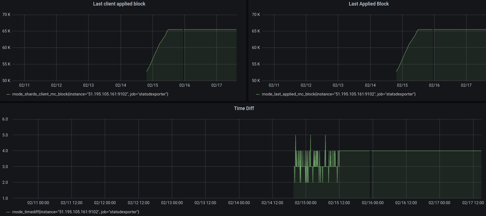
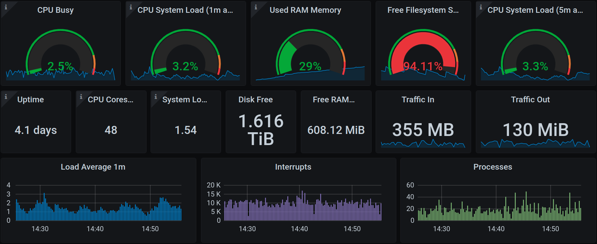
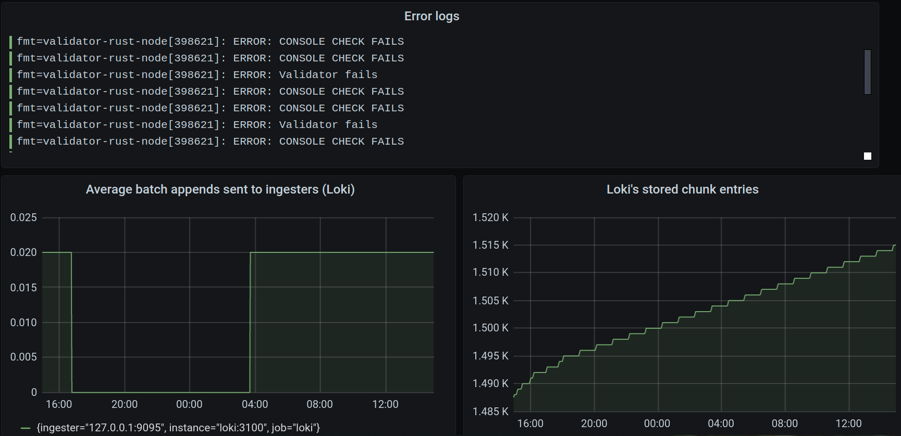
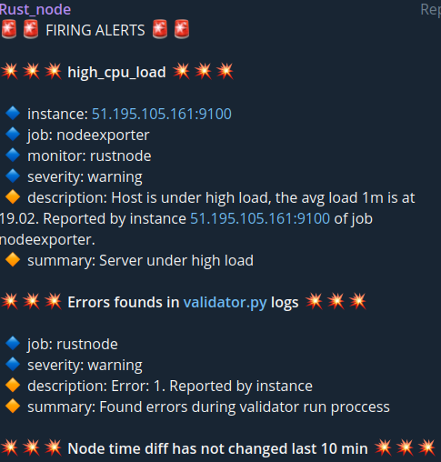

# **FreeTON Rust Node Installation guide**

All scripts are in the active development stage and will be updated regularly. Feel free to contact us using Github issues, directly on Telegram (@sostrovskyi, @renatSK, @azavodovskyi) or better in [INTONNATION PUB telegram chat](https://t.me/intonnationpub), where we support everyone who is using our scripts and answer all the questions.

This guide contains instructions on how to build and configure a RUST validator node in the Free TON blockchain. The instructions and scripts can be executed on any Debian based Linux distributions but were verified on Ubuntu 18.04 and Ubuntu 20.04. TON node installation **doesn't use Docker** because of some potential users concerns and its specific setup for such applications.

## System requirements


### TON Rust node


<table>
  <tr>
   <td><strong>Configuration</strong>
   </td>
   <td><strong>CPU (threads)</strong>
   </td>
   <td><strong>RAM (GiB)</strong>
   </td>
   <td><strong>Storage (GiB)</strong>
   </td>
   <td><strong>Network (Gbit/s)</strong>
   </td>
   <td><strong>Operating system</strong>
   </td>
  </tr>
  <tr>
   <td>Minimum
   </td>
   <td>48
   </td>
   <td>64
   </td>
   <td>1000
   </td>
   <td>1
   </td>
   <td>Ubuntu 20.04 \
Ubuntu 18.04
   </td>
  </tr>
</table>


SSD/NVMe disks are obligatory.


### Monitoring server


<table>
  <tr>
   <td><strong>Configuration</strong>
   </td>
   <td><strong>CPU (threads)</strong>
   </td>
   <td><strong>RAM (GiB)</strong>
   </td>
   <td><strong>Storage (GiB)</strong>
   </td>
   <td><strong>Network (Mbit/s)</strong>
   </td>
   <td><strong>Operating system</strong>
   </td>
  </tr>
  <tr>
   <td>Minimum
   </td>
   <td>4
   </td>
   <td>4
   </td>
   <td>500
   </td>
   <td>100
   </td>
   <td>Ubuntu 20.04 \
Ubuntu 18.04
   </td>
  </tr>
</table>

## Prerequisites

1. Free TON Rust node server with public IP and system requirements described above.
2. **Optional** monitoring server with public IP and system requirements described above.
3. Depool or multisig with enough funds to stake:

    1. **Preferable**. For a depool validator it is necessary to create and deploy a validator [SafeMultisig](https://github.com/tonlabs/ton-labs-contracts/tree/master/solidity/safemultisig) wallet in 0 chain, a depool in 0 chain, put files msig.keys.json and helper.keys.json to keys directory and configure msig_addr and helper_addr in ansible/group_vars/rustnode env file.
        Documentation: [Run DePool v3](https://docs.ton.dev/86757ecb2/p/04040b-run-depool-v3)

    2. For direct staking validator it is necessary to create and deploy a validator [SafeMultisig](https://github.com/tonlabs/ton-labs-contracts/tree/master/solidity/safemultisig) wallet in -1 chain, put file msig.keys.json to keys directory and configure msig_addr in ansible/group_vars/rustnode env file.
        Documentation: [Multisignature Wallet Management in TONOS-CLI](https://docs.ton.dev/86757ecb2/p/94921e-multisignature-wallet-management-in-tonos-cli)

## Getting started

There are 2 methods of installation - from remote host and locally. The only difference will be in hosts file configuration described below. If you are going to run start.sh from remote host, Operating System should be also Ubuntu. For Mac OS you should install Ansible yourself and use it directly without start.sh.

Scripts support optional monitoring server installation to be able to get statistic about TON node and server. It's required to setup it on a separate VM to avoid performance degradation.

1. Clone project repository (on either remote host or locally)
```
git clone https://github.com/INTONNATION/FreeTON-Rust-Node.git
cd FreeTON-Rust-Node
```
2. Configure variables in ansible/group_vars (refer to Variables section)
3. Configure hosts file. Put public IP address under rustnode and optionally under monitoring server section. Examples:
    1. Example hosts file if running Rust node and monitoring-server remotely:
    ```
    [monitoring-server]
    64.221.146.31
    
    [rustnode]
    131.11.89.30
    ```
    2. Example hosts file if running Rust node locally with remote monitoring-server:
    ```
    [monitoring-server]
    64.221.146.31 
    
    [rustnode]
    131.11.89.30 ansible_connection=local
    ```
    3. Example hosts file if running Rust node and monitoring server locally (**not recommended**):
    ```
    [monitoring-server]
    131.11.89.30 ansible_connection=local
    
    [rustnode]
    131.11.89.30 ansible_connection=local
    ```
    4. Example hosts file if running only Rust node locally (don't forget do disable remote logging in variables section):
    ```
    [monitoring-server]
    
    [rustnode]
    131.11.89.30 ansible_connection=local
    ```
4. Execute start script depending on required action, where --remote-user is an already created user on remote server(can be root) for Ansible ssh connection.
```
./start.sh --remote-user ubuntu --action install   # installation
./start.sh --remote-user ubuntu --action reinstall # changes keys, configs, variables, restarts systemd services
./start.sh --remote-user ubuntu --action upgrade   # build or download new release
```
5. Follow prompts

It is also possible to use Ansible directly without start.sh and interactive output. "-u ubuntu" is an already created user on remote server for Ansible ssh connection. In case of "-u root" there is no need to use "--become --become-method=sudo --ask-become-pass".
```
# Rustnode
ansible-playbook -i hosts -u ubuntu --become --become-method=sudo --ask-become-pass --private-key <keypath> --tags install ansible/rustonde.yml
ansible-playbook -i hosts -u ubuntu --become --become-method=sudo --ask-become-pass --private-key <keypath> --tags reinstall ansible/rustonde.yml
ansible-playbook -i hosts -u ubuntu --become --become-method=sudo --ask-become-pass --private-key <keypath> --tags upgrade ansible/rustonde.yml

# Monitoring server
ansible-playbook -i hosts -u ubuntu --become --become-method=sudo --ask-become-pass --private-key <keypath> --tags install ansible/monitoring-server.yml
``` 

## Variables

All variables are described inside env files under ansible/group_vars/ directory.

## Features

*   Easy install with help of _start.sh_
*   Validator script written on Python (supports Single and Depool validation(**Preferable**))
*   Validator script controlled by systemd (Cron job failures can be disastrous! **NO CRON** anymore!)
*   No need to have additional tick tock script (all validator logic in one place)
*   Embedded RUST validator node release management or remote build from any commit
*   Upgrade RUST validator node and restart (from scratch) capability
*   Remove service restarts for console keys generation
*   Easy to understand and sequential installation procedure (without node start/stop/start manipulation with configs)
*   Configurable logging levels
*   Support of remote log shipping (syslog compatible) (to optimize IOPS)
*   Grafana/loki monitoring
*   Alerting to Telegram channel based on metrics
*   Alerting to Telegram channel based on validator script logs and Rust node logs

## Technology stack

*   **Ansible** - tool which automates all the configuration
*   **Python** - used for validator service
*   **BASH** - used for reusable scripts which can be run on remote VM.
*   **Prometheus** - scrapes metrics from TON-OS-DApp-Server components
*   **Promtail** - logs aggregator/parser
*   **Loki** - log storage 
*   **Grafana** - metrics and logs viewer
*   **Alertmanager** - responsible for alerts and notifications
*   **Alertgram** - Telegram alerts
*   **Node-exporter** - linux VMs metrics agent
*   **Statsd-exporter** - stastd metrics agent

## Build

Installation scripts support remote source code build of the [tonlabs-rust-node](https://github.com/tonlabs/ton-labs-node) and [ton-labs-node-tools](https://github.com/tonlabs/ton-labs-node-tools) or alternatively downloading already compiled binaries from Github releases inside this repository(**Preferable**). NOTE: current builds don't contain metrcis feature to avoid performance degradation in Rust Cup. By skipping remote builds you will be able to automatically upgrade validator nodes without performance degradation on remote nodes. INTONNATION team will take responsibility to build and release compiled binaries for each [tonlabs-rust-node](https://github.com/tonlabs/ton-labs-node) stable release. We recommend to star this project to receive notification about new rustnode releases.
It’s possible to set a specific version or use the latest available code from the master branch. To choose scripts behaviour you can use _build: true/false _variable (refer to Variables section)
Build procedure described in scripts/build.sh. Release procedure described in .github/workflows/[main.yml](https://github.com/INTONNATION/FreeTON-Rust-Node/blob/main/.github/workflows/main.yml).

## Validator scripts

All validator scripts are rewritten on Python. To run validator with our scripts you just need to run one systemd service. All validator logic executes as one process. No need to use several cron jobs. Validator script is running and controlled by systemd service with centralized logging / monitoring and management out of the box. Validator script handles all Tik Tok messages under the hood and sends messages only twice per validation cycle to optimize gas consumption. Python scripts written using tonos-cli but we already started reworking this to use SDK directly, this will provide ability to deeply debug and handle any issue.  See _scripts/sdkvalidator.py _(we have plans to finish it during next months).

## Monitoring Server

Monitoring server installation includes metrics and logs aggregation, parsing, visualization and alerting. Metrics approach is based on Prometheus, Promtail, Grafana, Alertmanager, and Alertgram installed on a separate server using docker-compose. TON node server installation includes node and statsd metrics exporters which send metrics to the monitoring server.

Each component of the monitoring system have an info/view panel, which can be accessible using the following URLs:

* **Grafana** - http://[monitoring-server-ip]:3000/
* **Prometheus** - http://[monitoring-server-ip]:9090/
* **Loki** - http://[monitoring-server-ip]:3100/
* **Promtail** - http://[monitoring-server-ip]:9080/
* **Alertmanager** - http://[monitoring-server-ip]:9090/

Default credentials should be configured in group_vars/monitoring_server variables file.

**NOTE**: for the working state of the monitoring server you have to open several ports:
*   3000(TCP&UDP) Grafana
*   1541(TCP) Promtail Syslog receiver
Opening all other ports is risky and **not necessarily**.

All monitoring server components are deployed as separate docker containers so you can use docker commands to inspect containers like this:
```
docker ps            # check running containers
docker inspect Loki  # check container specific params 
docker logs Loki     # get container logs
```

We have provided handy dashboards in Grafana which include information about server performance and TON node metrics.

### Dashboards 

#### TON nodes stats



Dashboard provides information about Last client block, Last applied block, and synchronization time diff of the node. This view based on metrics from statsd that was configured by default. Also, the dashboard has the possibility to choose a hostname in case you have several TON nodes running.

**NOTE**: you need to build TON node with ton_node_build_args: "--release --features metrics" variable.

#### TON node Host overview



This dashboard provides an information about system resources of the TON node host based on metrics imported from node_exporter. Detailed info and list of supported host metrics you can find here: [https://github.com/prometheus/node_exporter](https://github.com/prometheus/node_exporter). Dashboard also has a possibility to choose a hostname in case you have several TON node hosts.

#### TON Rust node & validator logs



Those dashboards are based on logs imported from rustnode and rustvalidator systemd services. There are several views that streams ERROR logs from apps and chunks rate of Loki. You can customize the level of the logs using labels. Dashboard also has a possibility to choose a hostname in case you have several node hosts.

You can look for explore section of Grafana and choose Loki as a data source. The list of basic labels presented below:

*   app_name
*   job
*   level
*   rustnode
*   facility

Also you can configure the additional labels in promtail config in section syslog server if needed.

### Alerts



Loki and Prometheus have been configured with helpful alerts rules which includes notifications for both TON node host status and TON node Rust application:
* CPU usage 
* RAM usage 
* Disk usage
* Network usage
* TON node time diff

Alerts can be received on Telegram chat or channel. You have to create a Telegram API token and chat/channel(id is needed) and specify them in group_vars/monitoring_server.

HOW TO:
* [Get telegram API token](https://core.telegram.org/bots#6-botfather)
* [Get telegram chat IDs](https://github.com/GabrielRF/telegram-id)

### Logging architecture

Especially for TON Rust validator nodes we implement a log shipping approach without storing and even writing logs to the disk. It was especially done to optimize performance during the Rust Cap competition. Rust node sends logs directly to remote monitoring server without writing them to Syslog or any file. It was done with help of piping stdout/stderr output to logger utility which sends logs directly to Promtail.

You can find Rust node logging configuration in group_vars/rustnode. Where you can customize loglevel and remote logging configuration options:
*   remote=true   - send logs directly to promtail Syslog server(without saving on host) 
*   remote=false  - logs will be saved on the host

Loki also has configured with default alerts for rate errors from Node and Validator apps, which will be received to Telegram.
